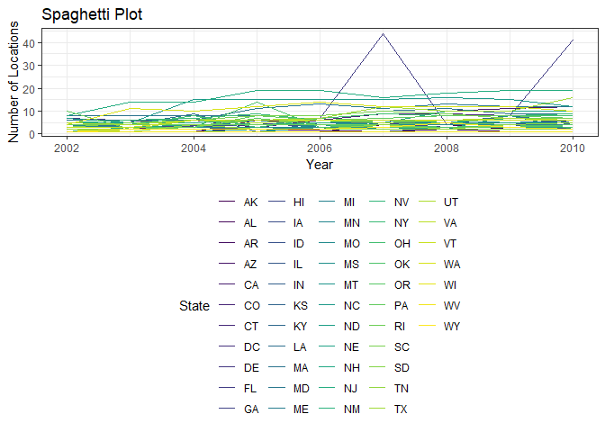
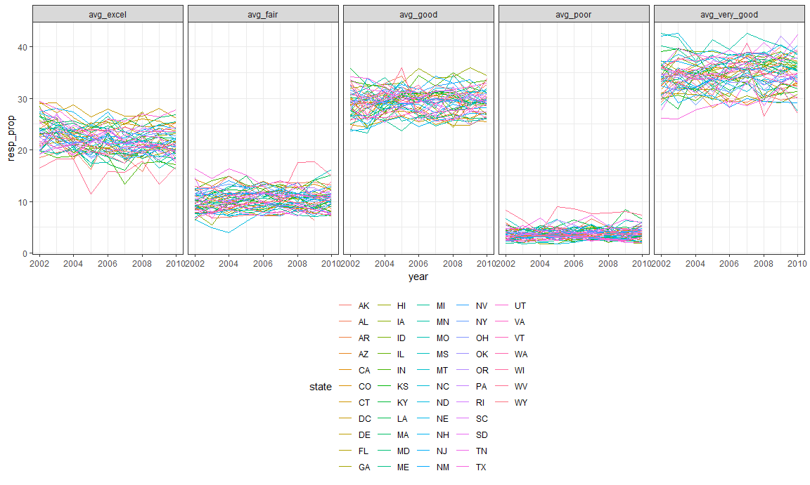

HW3
================
Jianyou Liu
October 13, 2018

``` r
library(p8105.datasets)
data("brfss_smart2010")
```

``` r
tidy_brfss = 
  janitor::clean_names(brfss_smart2010) %>% 
  filter(topic == "Overall Health", response == "Excellent"|response == "Very good"|response == "Good"|response == "Fair"|response == "Poor") %>% 
  rename(state = locationabbr, county = locationdesc, resp_id = respid)  %>% 
  mutate(response = as.factor(response)) %>% 
  arrange(match(response, c("Excellent", "Very good", "Good", "Fair", "Poor")))
  
tidy_brfss
```

    ## # A tibble: 10,625 x 23
    ##     year state county class topic question response sample_size data_value
    ##    <int> <chr> <chr>  <chr> <chr> <chr>    <fct>          <int>      <dbl>
    ##  1  2010 AL    AL - ~ Heal~ Over~ How is ~ Excelle~          94       18.9
    ##  2  2010 AL    AL - ~ Heal~ Over~ How is ~ Excelle~          91       15.6
    ##  3  2010 AL    AL - ~ Heal~ Over~ How is ~ Excelle~          58       20.8
    ##  4  2010 AZ    AZ - ~ Heal~ Over~ How is ~ Excelle~         269       27.3
    ##  5  2010 AZ    AZ - ~ Heal~ Over~ How is ~ Excelle~          68       17  
    ##  6  2010 AZ    AZ - ~ Heal~ Over~ How is ~ Excelle~         133       20.5
    ##  7  2010 AR    AR - ~ Heal~ Over~ How is ~ Excelle~          67       23.1
    ##  8  2010 AR    AR - ~ Heal~ Over~ How is ~ Excelle~         100       29  
    ##  9  2010 AR    AR - ~ Heal~ Over~ How is ~ Excelle~          47       24.1
    ## 10  2010 CA    CA - ~ Heal~ Over~ How is ~ Excelle~         167       24  
    ## # ... with 10,615 more rows, and 14 more variables:
    ## #   confidence_limit_low <dbl>, confidence_limit_high <dbl>,
    ## #   display_order <int>, data_value_unit <chr>, data_value_type <chr>,
    ## #   data_value_footnote_symbol <chr>, data_value_footnote <chr>,
    ## #   data_source <chr>, class_id <chr>, topic_id <chr>, location_id <chr>,
    ## #   question_id <chr>, resp_id <chr>, geo_location <chr>

``` r
tidy_brfss %>% 
  filter(year == 2002) %>% 
  group_by(state) %>% 
  summarize(n = n_distinct(county)) %>% 
  filter(n == 7)
```

    ## # A tibble: 3 x 2
    ##   state     n
    ##   <chr> <int>
    ## 1 CT        7
    ## 2 FL        7
    ## 3 NC        7

``` r
tidy_brfss %>% 
  group_by(state, year) %>% 
  summarize(n = n_distinct(county)) %>% 
  ggplot(aes(x = year, y = n, color = state)) +
  geom_line() +
  labs(
    title = "Spaghetti Plot",
    x = "Year",
    y = "Number of Locations"
  ) +
   viridis::scale_color_viridis(
    name = "State", 
    discrete = TRUE
   )
```



``` r
tidy_brfss %>% 
  filter(state == "NY", year == 2002|year == 2006|year ==2010, response == "Excellent") %>%
  group_by(year, state) %>% 
  summarize(mean_excel_prop = mean(data_value), sd_excel_prop = sd(data_value)) %>% 
  knitr::kable(digits = 2)
```

|  year| state |  mean\_excel\_prop|  sd\_excel\_prop|
|-----:|:------|------------------:|----------------:|
|  2002| NY    |              24.04|             4.49|
|  2006| NY    |              22.53|             4.00|
|  2010| NY    |              22.70|             3.57|

``` r
tidy2_brfss = select(tidy_brfss, year:county, response, data_value) %>% 
  spread(response, data_value) %>% 
  janitor::clean_names() %>% 
  group_by(year, state) %>% 
  summarize(avg_excel = mean(excellent), avg_very_good = mean(very_good), avg_good = mean(good), avg_fair = mean(fair), avg_poor = mean(poor)) %>% 
  gather(key = avg_response_type, value = resp_prop, avg_excel:avg_poor)

ggplot(tidy2_brfss, aes(x = year, y = resp_prop, color = state)) +
  geom_line() +
  facet_grid(~avg_response_type)
```

    ## Warning: Removed 2 rows containing missing values (geom_path).


