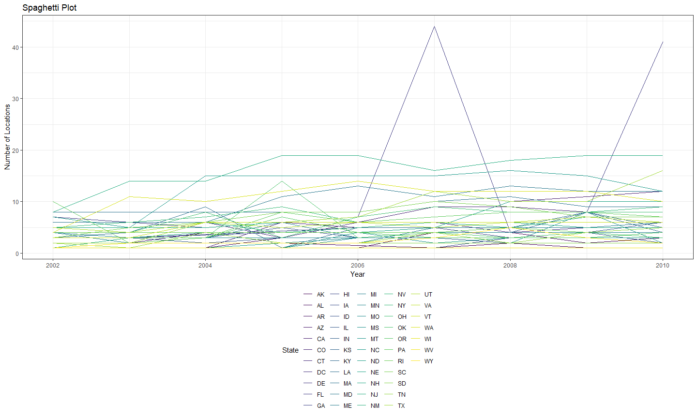
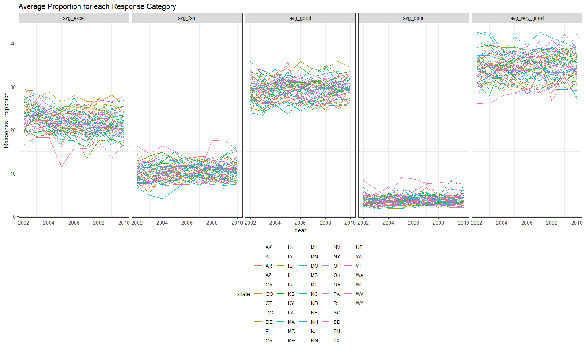
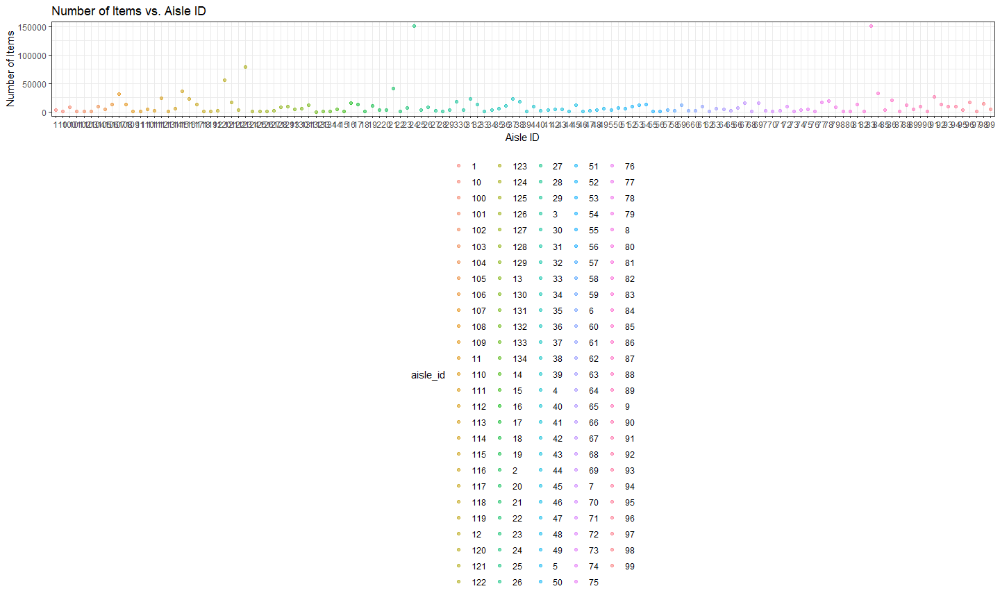
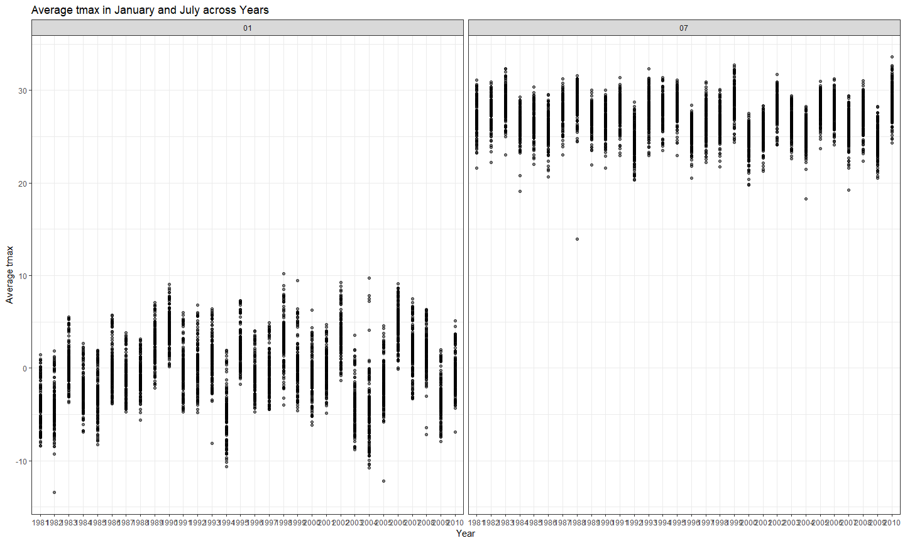
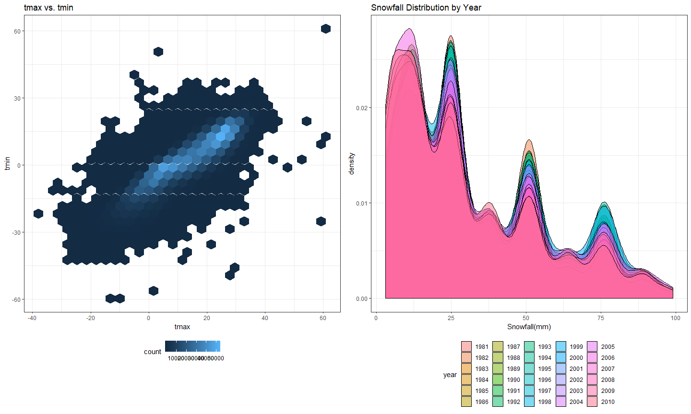

HW3
================
Jianyou Liu
October 13, 2018

Problem 1
---------

### Clean BRFSS dataset

``` r
data("brfss_smart2010")

# clean dataset
tidy_brfss = 
  janitor::clean_names(brfss_smart2010) %>% 
  filter(topic == "Overall Health", response == "Excellent"|response == "Very good"|response == "Good"|response == "Fair"|response == "Poor") %>% 
  rename(state = locationabbr, county = locationdesc, resp_id = respid)  %>% 
  mutate(response = as.factor(response)) %>% 
  arrange(match(response, c("Excellent", "Very good", "Good", "Fair", "Poor")))
```

### In 2002, which states were observed at 7 locations?

``` r
tidy_brfss %>% 
  filter(year == 2002) %>% 
  group_by(state) %>% 
  summarize(n = n_distinct(county)) %>% 
  filter(n == 7)
```

    ## # A tibble: 3 x 2
    ##   state     n
    ##   <chr> <int>
    ## 1 CT        7
    ## 2 FL        7
    ## 3 NC        7

Based on the table above, CT, FL, and NC were observed 7 times.

### Spaghetti plot

``` r
# create "spaghetti plot"
tidy_brfss %>% 
  group_by(state, year) %>% 
  summarize(n = n_distinct(county)) %>% 
  ggplot(aes(x = year, y = n, color = state)) +
  geom_line() +
  labs(
    title = "Spaghetti Plot",
    x = "Year",
    y = "Number of Locations"
  ) +
   viridis::scale_color_viridis(
    name = "State", 
    discrete = TRUE
   )
```



### Table showing the **mean** and **standard deviation** of the proportion of "Excellent" responses across locations in NY State of years **2002**, **2006**, and **2010**.

``` r
# create table
tidy_brfss %>% 
  filter(state == "NY", year == 2002|year == 2006|year ==2010, response == "Excellent") %>%
  group_by(year, state) %>% 
  summarize(mean_excel_prop = mean(data_value), sd_excel_prop = sd(data_value)) %>% 
  knitr::kable(digits = 2)
```

|  year| state |  mean\_excel\_prop|  sd\_excel\_prop|
|-----:|:------|------------------:|----------------:|
|  2002| NY    |              24.04|             4.49|
|  2006| NY    |              22.53|             4.00|
|  2010| NY    |              22.70|             3.57|

### Computation and five-panel plot generation

``` r
# computation of average propotion in each response category
tidy2_brfss = select(tidy_brfss, year:county, response, data_value) %>% 
  spread(response, data_value) %>% 
  janitor::clean_names() %>% 
  group_by(year, state) %>% 
  summarize(avg_excel = mean(excellent), avg_very_good = mean(very_good), avg_good = mean(good), avg_fair = mean(fair), avg_poor = mean(poor)) %>% 
  gather(key = avg_response_type, value = resp_prop, avg_excel:avg_poor)

# make five-panel plot
ggplot(tidy2_brfss, aes(x = year, y = resp_prop, color = state)) +
  geom_line() +
  facet_grid(~avg_response_type) +
  labs (
    title = "Average Proportion for each Response Category",
    x = "Year", 
    y = "Response Proportion"
  )
```

    ## Warning: Removed 2 rows containing missing values (geom_path).



Problem 2
=========

### Brief description and exploration of dataset

``` r
data("instacart")

dist_prod =  distinct(instacart, product_id, .keep_all = TRUE)
dist_user = distinct(instacart, user_id, .keep_all = TRUE)
```

This dataset comes from an online grocery store in NYC. The size of the dataset is 1384617, 15, with 1384617 observations. There are 39123 distinct products for sale and 131209 unique users. The order ids are the same for a single user. There are a total of 15 variables, of which *order id*, *product id*, and *user id* are key variables that identify observations. For example, the first row corresponds to the product "Bulgarian Yogurt" ordered from an user.

### How many aisles are there, and which aisles are the most items ordered from?

``` r
# number of unique aisles
nrow(distinct(instacart, aisle_id))
```

    ## [1] 134

``` r
# aisles from which most items are ordered
instacart %>% 
  group_by(aisle_id) %>% 
  summarize(n_items = n()) %>% 
  arrange(desc(n_items))
```

    ## # A tibble: 134 x 2
    ##    aisle_id n_items
    ##       <int>   <int>
    ##  1       83  150609
    ##  2       24  150473
    ##  3      123   78493
    ##  4      120   55240
    ##  5       21   41699
    ##  6      115   36617
    ##  7       84   32644
    ##  8      107   31269
    ##  9       91   26240
    ## 10      112   23635
    ## # ... with 124 more rows

There are 134 aisles and according to the table, aisle83 had the most items ordered from (150609).

### Plot of number of items ordered in each aisle

``` r
# create plot
instacart %>% 
  group_by(aisle_id) %>% 
  summarize(n_items = n()) %>%
  mutate(aisle_id = as.character(aisle_id)) %>% 
  ggplot(aes(x = as.character(aisle_id), y = n_items, color = aisle_id)) +
  geom_point(alpha = 0.5) +
  labs (
    title = "Number of Items vs. Aisle ID",
    x = "Aisle ID",
    y = "Number of Items"
  )
```



``` r
  viridis::scale_color_viridis(
    name = "Aisle ID", 
    discrete = TRUE
  )
```

    ## <ggproto object: Class ScaleDiscrete, Scale, gg>
    ##     aesthetics: colour
    ##     axis_order: function
    ##     break_info: function
    ##     break_positions: function
    ##     breaks: waiver
    ##     call: call
    ##     clone: function
    ##     dimension: function
    ##     drop: TRUE
    ##     expand: waiver
    ##     get_breaks: function
    ##     get_breaks_minor: function
    ##     get_labels: function
    ##     get_limits: function
    ##     guide: legend
    ##     is_discrete: function
    ##     is_empty: function
    ##     labels: waiver
    ##     limits: NULL
    ##     make_sec_title: function
    ##     make_title: function
    ##     map: function
    ##     map_df: function
    ##     n.breaks.cache: NULL
    ##     na.translate: TRUE
    ##     na.value: NA
    ##     name: Aisle ID
    ##     palette: function
    ##     palette.cache: NULL
    ##     position: left
    ##     range: <ggproto object: Class RangeDiscrete, Range, gg>
    ##         range: NULL
    ##         reset: function
    ##         train: function
    ##         super:  <ggproto object: Class RangeDiscrete, Range, gg>
    ##     reset: function
    ##     scale_name: viridis
    ##     train: function
    ##     train_df: function
    ##     transform: function
    ##     transform_df: function
    ##     super:  <ggproto object: Class ScaleDiscrete, Scale, gg>

### Most popular items

``` r
# table of most popular item ordered in specific aisle categories
instacart %>% 
  filter(aisle == "baking ingredients"| aisle == "dog food care"| aisle == "packaged vegetables fruits") %>% 
  group_by(aisle, product_name) %>% 
  summarize(n = n()) %>% 
  filter(min_rank(desc(n)) < 2) %>% 
  knitr::kable()
```

| aisle                      | product\_name                                 |     n|
|:---------------------------|:----------------------------------------------|-----:|
| baking ingredients         | Light Brown Sugar                             |   499|
| dog food care              | Snack Sticks Chicken & Rice Recipe Dog Treats |    30|
| packaged vegetables fruits | Organic Baby Spinach                          |  9784|

Based on the table, the most popular items ordered from aisle "Baking Ingredients", "Dog food care", "packaged vegetable fruits" are "light brown sugar", "snack sticks chicken...", and "organic baby spinach" respectively.

### Mean hour of the day

``` r
# table of mean hour of day at which some products are ordered on each day of the week
instacart %>% 
  filter(product_name == "Pink Lady Apples"| product_name == "Coffee Ice Cream") %>% 
  group_by(product_name, order_dow) %>% 
  summarize(mean_hour = mean(order_hour_of_day)) %>% 
  spread(key = order_dow, value = mean_hour) %>% 
  rename(Sunday = '0', Monday = '1', Tuesday = '2', Wednesday = '3', Thursday = '4', Friday = '5', Saturday = '6')%>% 
  knitr::kable(digits = 2)
```

| product\_name    |  Sunday|  Monday|  Tuesday|  Wednesday|  Thursday|  Friday|  Saturday|
|:-----------------|-------:|-------:|--------:|----------:|---------:|-------:|---------:|
| Coffee Ice Cream |   13.77|   14.32|    15.38|      15.32|     15.22|   12.26|     13.83|
| Pink Lady Apples |   13.44|   11.36|    11.70|      14.25|     11.55|   12.78|     11.94|

Problem 3
=========

### Short description

``` r
data("ny_noaa")
```

The size of this dataset is 2595176, 7. There are a total of 2595176 observations with each row corresponding to a observation from a weather station on a single day. There are 747 unique weather stations. The total number of variables is 7, of which "prcp", "snow", "snwd", "tmax", and "tmin" are key variables. The extent to which missing values is an issue is very large because there are 3387623 missing values in the entire dataset.

### Data cleaning

``` r
tidy_nynoaa = 
  separate(ny_noaa, date, into = c("year", "month", "day"), sep = "-") %>% 
  mutate(tmin = as.numeric(tmin), tmax = as.numeric(tmax), prcp = as.numeric(prcp), snow = as.numeric(snow), snwd = as.numeric(snwd)) %>% 
  mutate(prcp = prcp/10, tmax = tmax/10, tmin = tmin/10)
```

I cleaned the dataset by separating *year*, *month*, and *day* into distinct variables, converted quantitative variables into numeric, and recomputed observations for *prcp*, *tmin*, and *tmax* to reasonable units mm and degrees celsius as opposed to the initial 1/10th of mm and 1/10th of degrees celsius.

### Most common value for snowfall

``` r
tidy_nynoaa %>% 
  group_by(snow) %>% 
  summarize(n = n()) %>% 
  arrange(desc(n))
```

    ## # A tibble: 282 x 2
    ##     snow       n
    ##    <dbl>   <int>
    ##  1     0 2008508
    ##  2    NA  381221
    ##  3    25   31022
    ##  4    13   23095
    ##  5    51   18274
    ##  6    76   10173
    ##  7     8    9962
    ##  8     5    9748
    ##  9    38    9197
    ## 10     3    8790
    ## # ... with 272 more rows

Based on the table, the most commonly observed value is 0, because throughout the days in a year, there is no snowfall in the majority of times.

### Two-panel plot for average tmax

``` r
# create 2-panel plot
tidy_nynoaa %>% 
  filter(month == "01"| month == "07") %>% 
  group_by(id, year, month) %>% 
  summarize(avg_tmax = mean(tmax, na.rm = TRUE)) %>% 
  ggplot(aes(x = year, y = avg_tmax)) +
  geom_point(alpha = .5) +
  facet_grid(~month) +
  labs (
    title = "Average tmax in January and July across Years",
    x = "Year",
    y = "Average tmax"
  )
```

    ## Warning: Removed 5970 rows containing missing values (geom_point).



According to the plot, the average max temperatures for each station across years are generally lower in January than in July. In January, the mean max temperatures are scattered around 0 degrees while those for July are scattered around 25 degrees. There seems to be an outlier value in January of 1982 of around -15 degrees, and another one in July of 1988 of around 15 degrees.

### Juxtaposition of different plots using patchwork

``` r
# create plot for tmax vs. tmin
p1 = tidy_nynoaa %>% 
  ggplot(aes(x = tmax, y = tmin)) +
  geom_hex()

# create plot for distribution of snowfall 
p2 = tidy_nynoaa %>% 
  filter(snow < 100 & snow > 0) %>% 
  ggplot(aes(x = snow, fill = year)) +
           geom_density(alpha = .5)
# use patchwork package to combine panels
p1 + p2
```

    ## Warning: Removed 1136276 rows containing non-finite values (stat_binhex).


