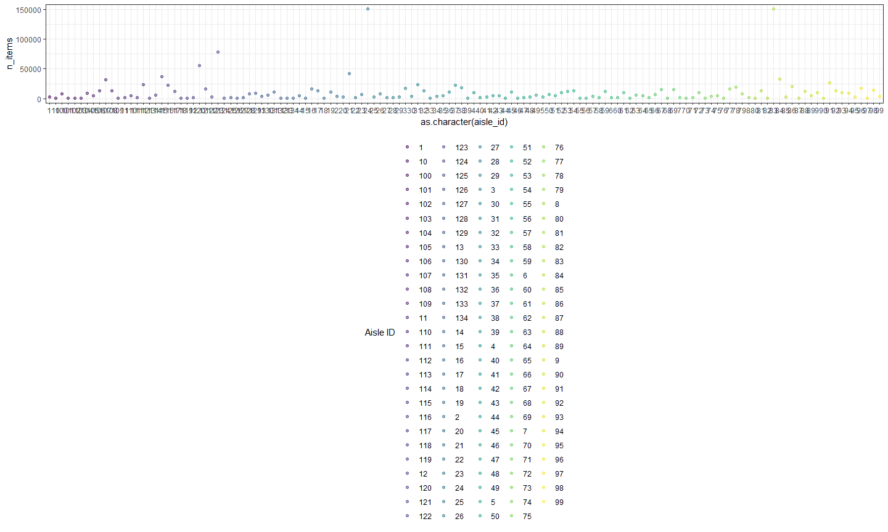
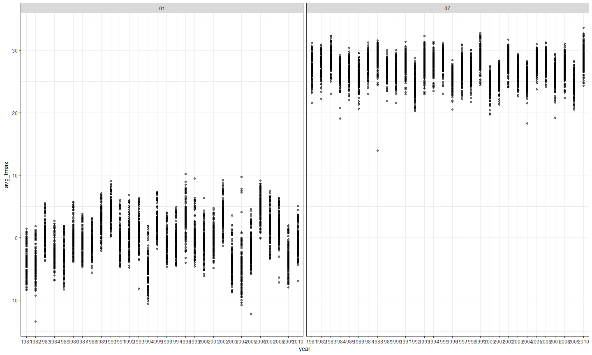
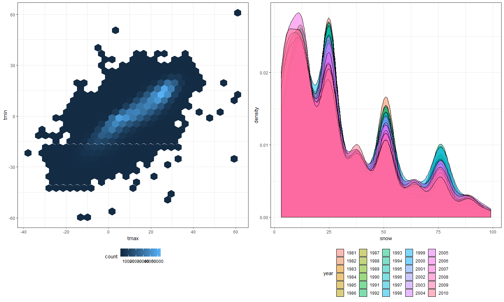

HW3
================
Jianyou Liu
October 13, 2018

Problem 1
=========

``` r
library(p8105.datasets)
data("brfss_smart2010")
```

``` r
tidy_brfss = 
  janitor::clean_names(brfss_smart2010) %>% 
  filter(topic == "Overall Health", response == "Excellent"|response == "Very good"|response == "Good"|response == "Fair"|response == "Poor") %>% 
  rename(state = locationabbr, county = locationdesc, resp_id = respid)  %>% 
  mutate(response = as.factor(response)) %>% 
  arrange(match(response, c("Excellent", "Very good", "Good", "Fair", "Poor")))
  
tidy_brfss
```

    ## # A tibble: 10,625 x 23
    ##     year state county class topic question response sample_size data_value
    ##    <int> <chr> <chr>  <chr> <chr> <chr>    <fct>          <int>      <dbl>
    ##  1  2010 AL    AL - ~ Heal~ Over~ How is ~ Excelle~          94       18.9
    ##  2  2010 AL    AL - ~ Heal~ Over~ How is ~ Excelle~          91       15.6
    ##  3  2010 AL    AL - ~ Heal~ Over~ How is ~ Excelle~          58       20.8
    ##  4  2010 AZ    AZ - ~ Heal~ Over~ How is ~ Excelle~         269       27.3
    ##  5  2010 AZ    AZ - ~ Heal~ Over~ How is ~ Excelle~          68       17  
    ##  6  2010 AZ    AZ - ~ Heal~ Over~ How is ~ Excelle~         133       20.5
    ##  7  2010 AR    AR - ~ Heal~ Over~ How is ~ Excelle~          67       23.1
    ##  8  2010 AR    AR - ~ Heal~ Over~ How is ~ Excelle~         100       29  
    ##  9  2010 AR    AR - ~ Heal~ Over~ How is ~ Excelle~          47       24.1
    ## 10  2010 CA    CA - ~ Heal~ Over~ How is ~ Excelle~         167       24  
    ## # ... with 10,615 more rows, and 14 more variables:
    ## #   confidence_limit_low <dbl>, confidence_limit_high <dbl>,
    ## #   display_order <int>, data_value_unit <chr>, data_value_type <chr>,
    ## #   data_value_footnote_symbol <chr>, data_value_footnote <chr>,
    ## #   data_source <chr>, class_id <chr>, topic_id <chr>, location_id <chr>,
    ## #   question_id <chr>, resp_id <chr>, geo_location <chr>

``` r
tidy_brfss %>% 
  filter(year == 2002) %>% 
  group_by(state) %>% 
  summarize(n = n_distinct(county)) %>% 
  filter(n == 7)
```

    ## # A tibble: 3 x 2
    ##   state     n
    ##   <chr> <int>
    ## 1 CT        7
    ## 2 FL        7
    ## 3 NC        7

``` r
tidy_brfss %>% 
  group_by(state, year) %>% 
  summarize(n = n_distinct(county)) %>% 
  ggplot(aes(x = year, y = n, color = state)) +
  geom_line() +
  labs(
    title = "Spaghetti Plot",
    x = "Year",
    y = "Number of Locations"
  ) +
   viridis::scale_color_viridis(
    name = "State", 
    discrete = TRUE
   )
```


``` r
tidy_brfss %>% 
  filter(state == "NY", year == 2002|year == 2006|year ==2010, response == "Excellent") %>%
  group_by(year, state) %>% 
  summarize(mean_excel_prop = mean(data_value), sd_excel_prop = sd(data_value)) %>% 
  knitr::kable(digits = 2)
```

|  year| state |  mean\_excel\_prop|  sd\_excel\_prop|
|-----:|:------|------------------:|----------------:|
|  2002| NY    |              24.04|             4.49|
|  2006| NY    |              22.53|             4.00|
|  2010| NY    |              22.70|             3.57|

``` r
tidy2_brfss = select(tidy_brfss, year:county, response, data_value) %>% 
  spread(response, data_value) %>% 
  janitor::clean_names() %>% 
  group_by(year, state) %>% 
  summarize(avg_excel = mean(excellent), avg_very_good = mean(very_good), avg_good = mean(good), avg_fair = mean(fair), avg_poor = mean(poor)) %>% 
  gather(key = avg_response_type, value = resp_prop, avg_excel:avg_poor)

ggplot(tidy2_brfss, aes(x = year, y = resp_prop, color = state)) +
  geom_line() +
  facet_grid(~avg_response_type)
```

    ## Warning: Removed 2 rows containing missing values (geom_path).

 \# Problem 2

``` r
data("instacart")

dist_prod =  distinct(instacart, product_id, .keep_all = TRUE)
dist_user = distinct(instacart, user_id, .keep_all = TRUE)
```

This dataset comes from an online grocery store in NYC. The size of the dataset is 1384617, 15, with 1384617 observations. There are 39123 distinct products for sale and 131209 unique users. The order ids are the same for a single user. There are a total of 15 variables, of which *order id*, *product id*, and *user id* are key variables that identify observations. For example, the first row corresponds to the product "Bulgarian Yogurt" ordered from an user.

``` r
nrow(distinct(instacart, aisle_id))
```

    ## [1] 134

``` r
instacart %>% 
  group_by(aisle_id) %>% 
  summarize(n_items = n()) %>% 
  arrange(desc(n_items))
```

    ## # A tibble: 134 x 2
    ##    aisle_id n_items
    ##       <int>   <int>
    ##  1       83  150609
    ##  2       24  150473
    ##  3      123   78493
    ##  4      120   55240
    ##  5       21   41699
    ##  6      115   36617
    ##  7       84   32644
    ##  8      107   31269
    ##  9       91   26240
    ## 10      112   23635
    ## # ... with 124 more rows

``` r
instacart %>% 
  group_by(aisle_id) %>% 
  summarize(n_items = n()) %>%
  mutate(aisle_id = as.character(aisle_id)) %>% 
  ggplot(aes(x = as.character(aisle_id), y = n_items, color = aisle_id)) +
  geom_point(alpha = 0.5) +
  viridis::scale_color_viridis(
    name = "Aisle ID", 
    discrete = TRUE
  )
```



``` r
instacart %>% 
  filter(aisle == "baking ingredients"| aisle == "dog food care"| aisle == "packaged vegetables fruits") %>% 
  group_by(aisle, product_name) %>% 
  summarize(n = n()) %>% 
  filter(min_rank(desc(n)) < 2) 
```

    ## # A tibble: 3 x 3
    ## # Groups:   aisle [3]
    ##   aisle                    product_name                                  n
    ##   <chr>                    <chr>                                     <int>
    ## 1 baking ingredients       Light Brown Sugar                           499
    ## 2 dog food care            Snack Sticks Chicken & Rice Recipe Dog T~    30
    ## 3 packaged vegetables fru~ Organic Baby Spinach                       9784

``` r
instacart %>% 
  filter(product_name == "Pink Lady Apples"| product_name == "Coffee Ice Cream") %>% 
  group_by(product_name, order_dow) %>% 
  summarize(mean_hour = mean(order_hour_of_day)) %>% 
  spread(key = order_dow, value = mean_hour) %>% 
  rename(Sunday = '0', Monday = '1', Tuesday = '2', Wednesday = '3', Thursday = '4', Friday = '5', Saturday = '6')%>% 
  knitr::kable(digits = 2)
```

| product\_name    |  Sunday|  Monday|  Tuesday|  Wednesday|  Thursday|  Friday|  Saturday|
|:-----------------|-------:|-------:|--------:|----------:|---------:|-------:|---------:|
| Coffee Ice Cream |   13.77|   14.32|    15.38|      15.32|     15.22|   12.26|     13.83|
| Pink Lady Apples |   13.44|   11.36|    11.70|      14.25|     11.55|   12.78|     11.94|

Problem 3
=========

``` r
data("ny_noaa")
```

The size of this dataset is 2595176, 7. There are a total of 2595176 observations with each row corresponding to a observation from a weather station on a single day. There are 747 unique weather stations. The total number of variables is 7, of which "prcp", "snow", "snwd", "tmax", and "tmin" are key variables. The extent to which missing values is an issue is very large because there are 3387623 missing values in the entire dataset.

``` r
tidy_nynoaa = 
  separate(ny_noaa, date, into = c("year", "month", "day"), sep = "-") %>% 
  mutate(tmin = as.numeric(tmin), tmax = as.numeric(tmax), prcp = as.numeric(prcp), snow = as.numeric(snow), snwd = as.numeric(snwd)) %>% 
  mutate(prcp = prcp/10, tmax = tmax/10, tmin = tmin/10)
```

``` r
tidy_nynoaa %>% 
  group_by(snow) %>% 
  summarize(n = n()) %>% 
  arrange(desc(n))
```

    ## # A tibble: 282 x 2
    ##     snow       n
    ##    <dbl>   <int>
    ##  1     0 2008508
    ##  2    NA  381221
    ##  3    25   31022
    ##  4    13   23095
    ##  5    51   18274
    ##  6    76   10173
    ##  7     8    9962
    ##  8     5    9748
    ##  9    38    9197
    ## 10     3    8790
    ## # ... with 272 more rows

The units values for *prcp*, *tmin*, and *tmax* are recomputed to mm and degrees celsius. The most commonly observed value is 0, because throughout the days in a year, there is no snowfall in the majority of times.

``` r
tidy_nynoaa %>% 
  filter(month == "01"| month == "07") %>% 
  group_by(id, year, month) %>% 
  summarize(avg_tmax = mean(tmax, na.rm = TRUE)) %>% 
  ggplot(aes(x = year, y = avg_tmax)) +
  geom_point(alpha = .5) +
  facet_grid(~month)
```

    ## Warning: Removed 5970 rows containing missing values (geom_point).

 According to the plot, the average max temperatures for each station across years are generally lower in January than in July. In January, the mean max temperatures are scattered around 0 degrees while those for July are scattered around 25 degrees. There seems to be an outlier value in January of 1982 of around -15 degrees, and another one in July of 1988 of around 15 degrees.

``` r
library(hexbin)
library(patchwork)

p1 = tidy_nynoaa %>% 
  ggplot(aes(x = tmax, y = tmin)) +
  geom_hex()

p2 = tidy_nynoaa %>% 
  filter(snow < 100 & snow > 0) %>% 
  ggplot(aes(x = snow, fill = year)) +
           geom_density(alpha = .5)

p1 + p2
```

    ## Warning: Removed 1136276 rows containing non-finite values (stat_binhex).


